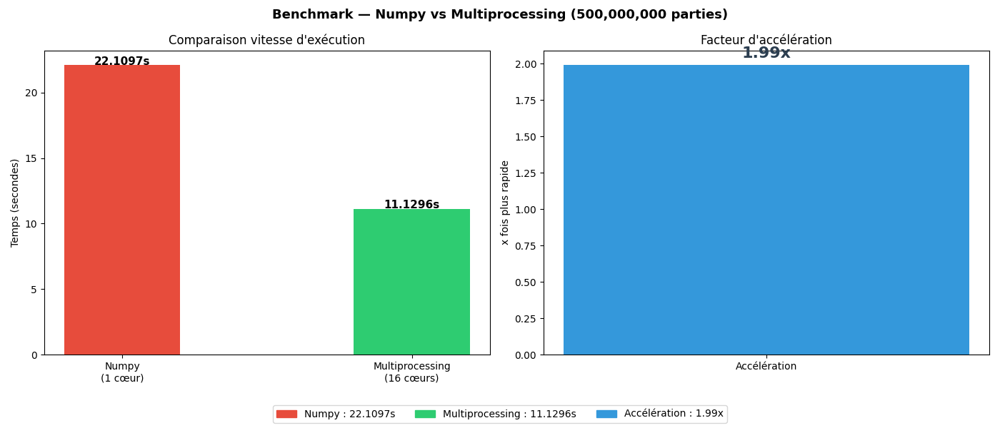
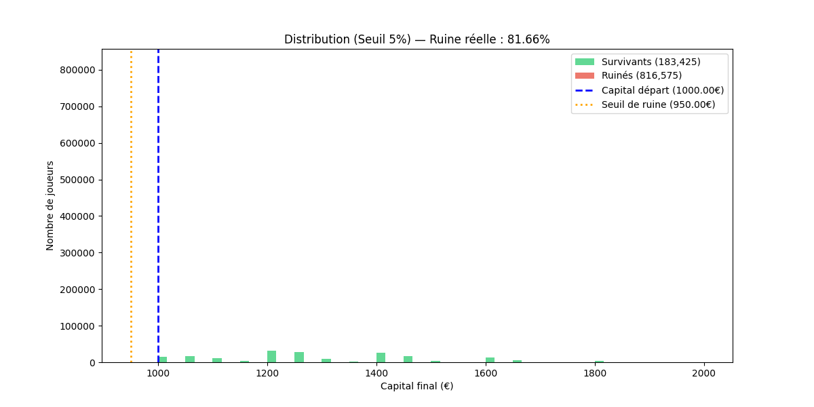
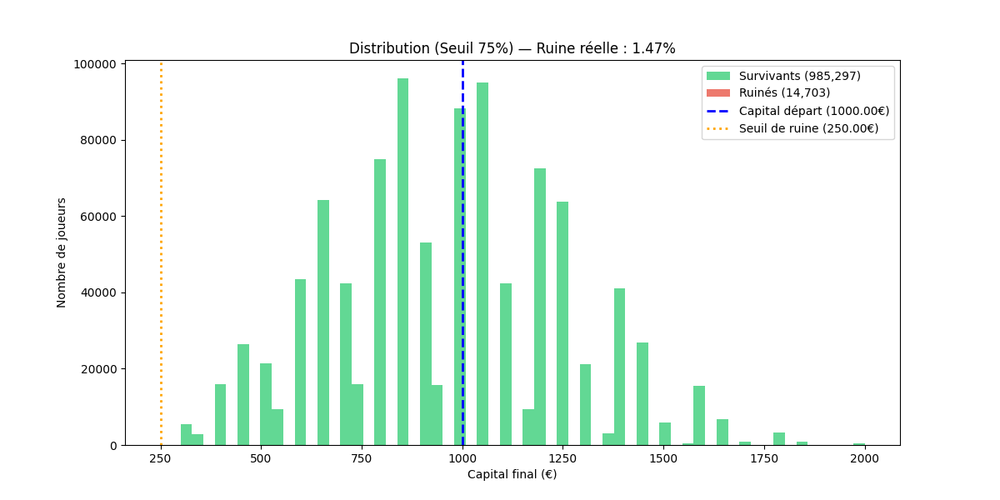
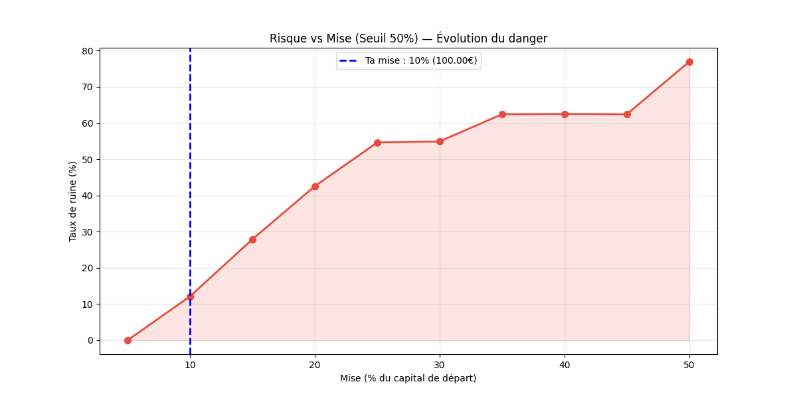
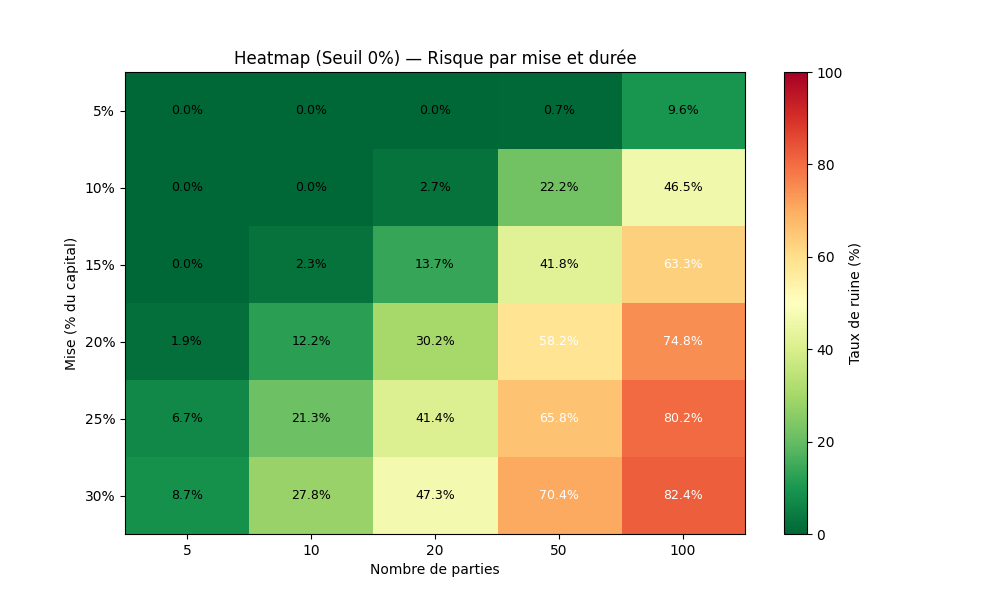

# 🎲 P1: CASINO : Simulateur Monte Carlo & Analyse du Risque de Ruine


---

## 📌 S.T.A.R: Résumé Exécutif

- **Situation :** Un jeu de casino cache une question mathématique fondamentale : Quelle stratégie de gestion du risque maximise la survie d'un capital face à la variance ?
- **Task :** Construire un moteur Monte Carlo simulant 1 000 000 de joueurs simultanément avec un seuil de ruine configurable.
- **Actions :** 4 versions: Boucle Python → Vectorisation NumPy → Multiprocessing 16 cœurs → Analyse du Risque de Ruine.
- **Results :** **1 000 000 joueurs simulés en < 10 secondes. Espérance : −5%/session. 8 profils de joueurs modélisés.**

---

## 💰 ROI & Scalabilité

$$ROI = \frac{Gain_{net} - Coût_{simulation}}{Capital_{initial}} \times 100$$

| Métrique | Valeur |
|:---|:---|
| **Joueurs simulés (V4)** | 1 000 000 |
| **Temps d'exécution** | < 10 secondes (16 cœurs) |
| **Accélération vs séquentiel** | ~1.99x (mesuré) |
| **Espérance mathématique** | −5% du volume misé |
| **Profils de joueurs testés** | 0% · 5% · 10% · 20% · 30% · 50% · 75% · 90% |

> **Valeur business :** Moteur réutilisable pour tout problème de gestion du risque: Portefeuille financier, A/B testing, Modélisation de churn.

---

## 🚀 Architecture: V1 → V4

- **V1 — Logique Core :** Moteur Joueur vs Croupier. Calcul ROI, tracking historique, détection de ruine.
- **V2 — Vectorisation NumPy :** Remplacement des boucles par `np.where`, `np.cumsum`. Gain : ×50 sur 1 000 simulations.
- **V3 — Multiprocessing :** Architecture Master/Worker avec `Pool.starmap`. 500M de parties sur 16 cœurs.
- **V4 — Risque de Ruine :** Hard Stop (`np.maximum.accumulate`), heatmap 30 cellules parallélisée, `gc.collect()`.

### ⚡ Puissance de Calcul: 500M parties mesurées


> **Mesuré : Numpy 22.11s → Multiprocessing 11.13s. Accélération réelle : 1.99x sur 16 cœurs.**

---

## 📊 Visuel à Valeur Décisionnelle

### Le Vrai Paradoxe du Stop-Loss
*Résultats mesurés sur 1 000 000 joueurs par seuil.*

| Seuil | Taux de ruine mesuré | Profil Joueur |
|:---|:---:|:---|
| **0%** | **0.03%** | Ruine totale acceptée: liberté maximale de variance |
| **5%** | **81.66%** | ❌ Catastrophique: éliminé au moindre pic de variance |
| **10%** | **76.93%** | ❌ Très dangereux — 3 joueurs sur 4 ruinés |
| **20%** | **54.66%** | ⚠️ Risque élevé: 1 joueur sur 2 ruiné |
| **30%** | **36.69%** | ⚠️ Risque modéré |
| **50%** | **12.13%** | 🟡 Acceptable |
| **75%** | **1.47%** | ✅ Très faible risque |
| **90%** | **0.22%** | ✅ Quasi nul |

**Insight data mesuré :** Un stop-loss trop serré (5-10%) est plus destructeur que pas de stop-loss du tout (0%). Le joueur qui s'arrête à la moindre perte est ruiné à 81%: la variance naturelle du jeu le sort systématiquement avant qu'il puisse rebondir.

| Seuil 5% — Ruine : 81.66% | Seuil 75% — Ruine : 1.47% |
|:---:|:---:|
|  |  |

### 📈 Courbe de Risque


> **Lecture : la courbe monte de façon quasi-linéaire jusqu'à 50% de mise. Au-delà, le risque se stabilise — la durée de jeu devient le facteur dominant.**

### 🔥 Modélisation: 1 000 000 scénarios croisés


> **Lecture : chaque cellule = taux de ruine réel pour une combinaison Mise × Durée. Le rouge est inévitable sur le long terme, quelle que soit la stratégie.**

---

## 🛠️ Stack Technique & Hard Skills

| Compétence | Niveau démontré |
|:---|:---|
| **NumPy** | Vectorisation massive, `np.maximum.accumulate`, masking booléen, broadcasting |
| **Multiprocessing** | `Pool.starmap`, worker autosuffisant, compatible Windows/Linux/Mac |
| **Matplotlib** | Heatmap `imshow`, histogramme masqué, `fill_between`, sous-échantillonnage |
| **Architecture** | Séparation des responsabilités, constantes globales, docstrings Args/Returns |
| **Gestion mémoire** | `del` + `gc.collect()`, calcul RAM anticipé par simulation |

---

## ⚠️ Limites & Conformité

- **Hypothèse principale :** Cartes 1-10 uniformes: simplifie les distributions réelles d'un casino.
- **Mise fixe :** Ne modélise pas les stratégies variables.
- **Disaster Recovery :** Sur machine < 8 Go RAM → réduire `N_SIMULATION` à 500 000 et `N_HEATMAP` à 20 000.
- **RGPD :** Aucune donnée personnelle collectée. Simulation purement mathématique.
- **Légal :** Projet académique. Hors périmètre AI Act. Hors réglementation ANJ.

---

## ⚙️ Installation & Lancement

```bash
git clone https://github.com/DaupinDavid/Roadmap-Projects.git
pip install numpy matplotlib
python projects/phase-1/p1-casino/v4_casino_risque_ruine.py
```

**Outputs automatiques (générés selon le seuil choisi, ex: 20%) :**
```
docs/
└── v4_ruine_{seuil}prct/
    ├── v4_1_joueur_{seuil}prct.png
    ├── v4_2_distrib_{seuil}prct.png
    ├── v4_3_courbe_{seuil}prct.png
    └── v4_4_heatmap_{seuil}prct.png
```

---

## 🚀 Conclusion & Perspectives

Ce projet n'est pas seulement une simulation de jeu: c'est une démonstration de la capacité à transformer un problème métier complexe en un modèle mathématique optimisé et scalable.

- **Maîtrise de la donnée :** Passage d'une logique itérative à une logique vectorisée pour traiter des volumes massifs.
- **Optimisation Hardware :** Distribution des calculs CPU-bound avec gestion rigoureuse de la mémoire vive.
- **Analyse Décisionnelle :** Extraction d'insights contre-intuitifs (le stop-loss serré est plus dangereux que l'absence de stop-loss) validés sur 1 000 000 de simulations.

---

## 💬 Contact

Ce type de modélisation ou d'optimisation de flux de données répond à vos enjeux ? Je suis ouvert aux échanges techniques.

[LinkedIn](https://www.linkedin.com/in/david-daupin/) 

---

*Projet 1: Casino Monté Carlo — Phase 1 · Roadmap Data Engineering *
